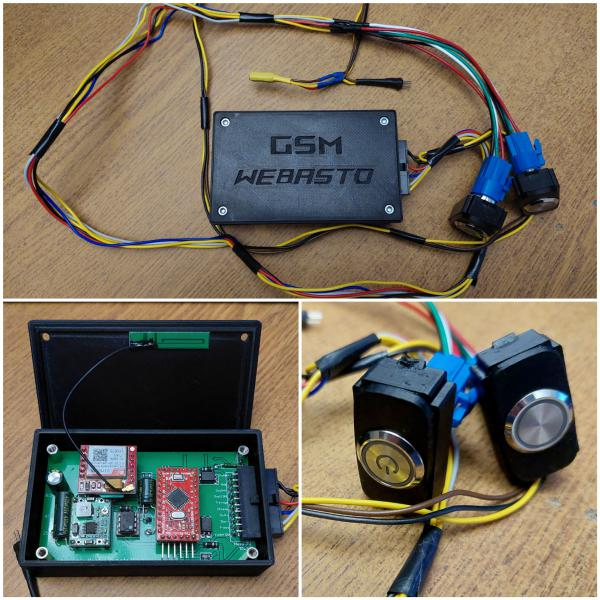

# Ardubasto: GSM/GPRS контроллер для предпусковых подогревателей с управлением по SMS и MQTT

**Автор проекта – [MaksVV](https://forum.arduino.ru/u/maksvv/) с форума arduino.ru**

[Чат в Telegram](https://t.me/ardubasto)

[Оригинальная тема](https://forum.arduino.ru/t/gsm-ustrojstvo-upravleniya-kotlami-webasto-i-ne-tolko/9851) на форуме forum.arduino.ru *При необходимости: [старая тема](https://arduino.ru/forum/proekty/gsm-ustroistvo-upravleniya-kotlami-webasto-i-ne-tolko)*

## Внимание! Репозиторий находится в разработке!

## [Основной Wiki](https://github.com/DimChik2903/ardubasto/wiki)

## Об устройстве
### Совместимость

* Запуск по потенциалу +12В (Webasto Thermo Top C/E)
* Запуск импульсом GND 1 сек (Webasto Thermo Top C/E)
* Запуск по шине W-Bus (Webasto Thermo Top C/E, Thermo Top Evo)
* Запуск по шине Eberspacher Hydronic
* Запуск по шине Бинар (?)

### Основные функции

* Запуск/останов котла
* Информация об ошибках
* Информация об основных параметрах котла
* Дополнительные внешние датчики температуры авто
* Работа с сигнализацеий (автозапуск)

## Быстрый старт

 [1. Закажи компоненты](https://github.com/DimChik2903/ardubasto/wiki/%D0%97%D0%B0%D0%BA%D0%B0%D0%B7-%D0%BA%D0%BE%D0%BC%D0%BF%D0%BE%D0%BD%D0%B5%D0%BD%D1%82%D0%BE%D0%B2)

 [2. Собери устройство](https://github.com/DimChik2903/ardubasto/wiki/%D0%A1%D0%B1%D0%BE%D1%80%D0%BA%D0%B0-%D1%83%D1%81%D1%82%D1%80%D0%BE%D0%B9%D1%81%D1%82%D0%B2%D0%B0)

 [3. Прошей](https://github.com/DimChik2903/ardubasto/wiki/%D0%9F%D1%80%D0%BE%D1%88%D0%B8%D0%B2%D0%BA%D0%B0)

 [4. Подключи](https://github.com/DimChik2903/ardubasto/wiki/%D0%9F%D0%BE%D0%B4%D0%BA%D0%BB%D1%8E%D1%87%D0%B5%D0%BD%D0%B8%D0%B5)
